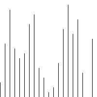

冒泡排序
====

## 定义
冒泡排序（Bubble Sort）是一种简单的排序算法。它重复地走访过要排序的数列，一次比较两个元素，如果他们的顺序错误就把他们交换过来。走访数列的工作是重复地进行直到没有再需要交换，也就是说该数列已经排序完成。

## 步骤：
1. 比较相邻的元素（从后往前）。如果第一个比第二个大，就交换他们两个。
2. 对每一对相邻元素作同样的工作，从开始第一对到结尾的最后一对。在这一点，最后的元素应该会是最大的数。
   (**如果这一步没有出现任何一次交换，那么说明所有的元素已经有序，不需要再进行下面的步骤了**)
3. 针对所有的元素重复以上的步骤，除了最后一个。
4. 持续每次对越来越少的元素重复上面的步骤，直到没有任何一对数字需要比较。

## 图片示例


## 代码实现
```go
// Sort 冒泡排序
func Sort(a []int) []int {
	for i := 0; i < len(a); i++ {
		for j := i + 1; j < len(a); j++ {
			if a[i] > a[j] {
				a[i], a[j] = a[j], a[i]
			}
		}
	}
	return a
}

```